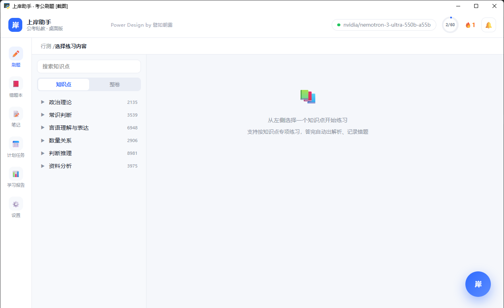
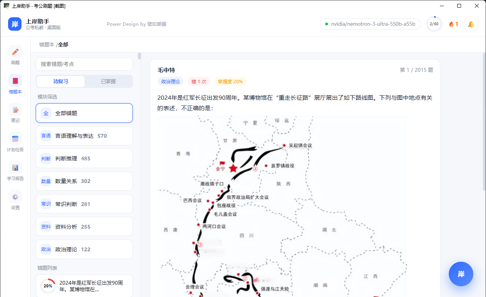
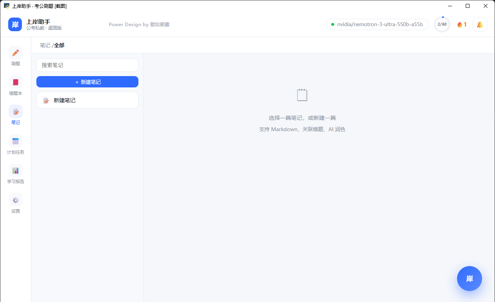
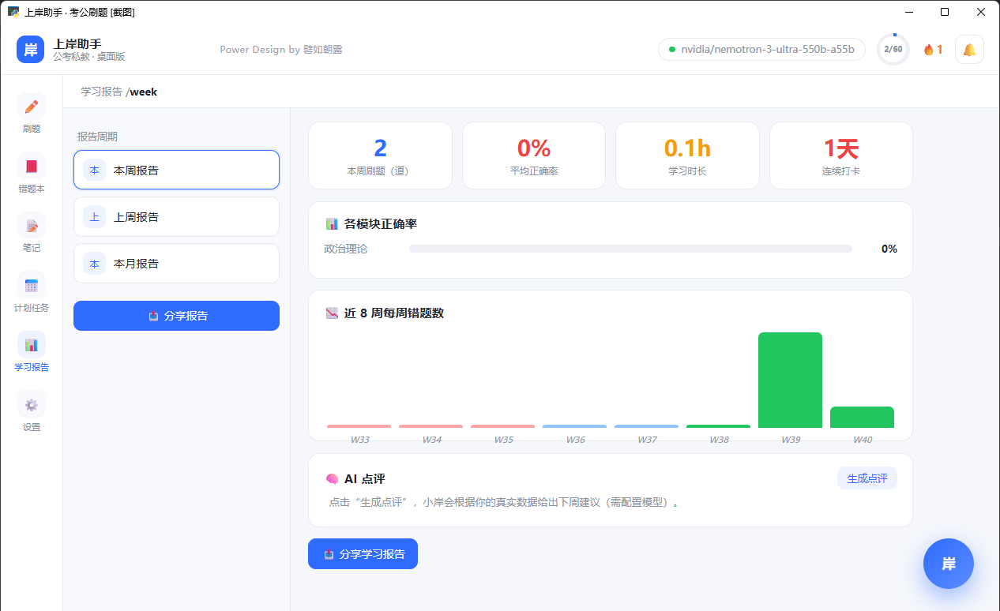

# 上岸助手

> 公考私教 · 桌面版 & 安卓版 · Power Design by 譬如朝露

上岸助手是一款面向公务员录用考试备考人群的学习软件，提供知识点专项练习、
错题管理、AI 私教讲解、学习笔记、计划任务与学习报告等功能。

练习内容基于用户本人的粉笔账号获取，讲解与点评由 AI 大模型驱动；
全部学习数据仅保存在用户本机，不上传任何服务器。

## 功能特性

- **刷题练习**：按模块 / 知识点专项练习，或整套真题模拟；交卷即时判分、展示解析，错题自动进入错题本
- **排除选项**：做题时可排除干扰项（划线置灰），贴近考场实际作答习惯
- **错题本**：云端同步粉笔错题，按艾宾浩斯记忆规律安排 1/3/7/15 天阶梯复习，掌握度随时间自动衰减，可标注「已掌握」
- **今日推荐**：自动定位你的薄弱知识点，一键开启专属特训题组；到期错题逐题清零
- **AI 私教「小岸」**：逐题引导式讲解、错因分析（一听就懂 / 一做就懵 / 边学边忘三大坑对症下药）、学习点评
- **学习报告**：刷题量、正确率、学习时长与连续打卡统计，支持生成 AI 点评与分享海报
- **笔记与计划**：Markdown 笔记、导出 PDF；计划任务与每日打卡
- **数据安全**：本地存储，支持一键导出 / 导入备份，换机迁移无忧

## 版本

**当前版本：V1.2**（2026-09-30 发布，2026-10-09 更新）

- **科学复习**：错题按艾宾浩斯记忆曲线安排 1/3/7/15 天阶梯复习，到期自动提醒，逐题清零
- **薄弱点特训**：刷题页新增「今日推荐」卡，自动定位最值得练的薄弱知识点，一键特训 5 题
- **掌握度升级**：掌握度随时间自然衰减，越久没复习越"生疏"，支持按到期 / 掌握度排序
- **AI 错因分析升级**：引入「一听就懂 / 一做就懵 / 边学边忘」三大坑框架，对症给出补救建议
- **界面与交互全面优化**：知识点树更舒展、错题到期颜色标记（今日到期=琥珀色 / 已过期=红色）、
  顶栏进度环达标变绿、连续打卡 7 天以上显示火焰天数、选项按压微动效、AI 快捷指令一键直达、
  交卷得分渐变大字、切页淡入过渡等十余处细节打磨
- **做题与解析再升级**（2026-10-09）：作答页行距加大、底部操作栏固定；解析页答案徽章与关键句着色，
  题目图片点击放大；选项排除改为长按操作；交卷未作答明确列出题号并支持跳回检查；
  新增退出练习、清空对话等入口；设置新增「字体与字号」（六种字体、四档字号，双端可用），
  另有字号加大、笔记防丢等十余处体验打磨

详细变更见 [《发版说明》](发版说明.md)，另有 [PDF 版](上岸助手V1.2发版说明.pdf)。

V1.1（2026-09-29）：

- 修复图形推理等题目配图无法显示的问题
- AI 助手错因分析更精准（自动结合您当次选择的选项）
- 新增选项排除（排除法做题）
- 手机端做题界面自动铺满全屏

## 下载与安装

| 平台 | 说明 |
| --- | --- |
| 桌面版（Windows 10 及以上 64 位） | 绿色单文件程序，双击「上岸助手.exe」即可运行，无需安装 |
| 安卓版（Android） | 安装「上岸助手安卓版.apk」，覆盖安装可保留全部数据 |

> 构建产物（exe / apk）不随源码分发，请按「构建方法」自行打包，或联系作者获取。

## 使用说明

详细的图文教程请阅随仓库附带的 PDF 手册：

- [《上岸助手 用户使用手册（桌面版）》](上岸助手使用说明.pdf)
- [《上岸助手 安卓版使用说明》](上岸助手安卓版使用说明.pdf)

手册面向无任何开发经验的普通用户，从粉笔账号连接、各功能模块使用，到数据备份与常见问题，均有逐步说明。

## 界面预览

| 刷题 | 错题本 |
| --- | --- |
|  |  |

| 笔记 | 学习报告 |
| --- | --- |
|  |  |

## 构建方法

### 桌面版

```bat
build_exe.bat
```

需要本机安装 Python 3.12（依赖见 requirements.txt）。构建结果输出至 `dist\上岸助手.exe`。

### 安卓版

```bat
cd android-app
gradle assembleDebug
```

需要 JDK 21 与 Android SDK。构建结果输出至 `android-app\android\app\build\outputs\apk\debug\app-debug.apk`。

## 目录结构

```
├── desktop/            桌面版（pywebview 外壳 + Python 后端 + Web 界面）
├── android-app/        安卓版（Capacitor 6 工程，JS 重写后端）
├── docs/shots/         界面截图（用于使用手册）
├── gen_*.py            三份 PDF 交付文档的生成脚本
├── fenbi_client.py     粉笔题库访问封装
└── server.py           网页版服务入口
```

## 粉笔账号获取教程

软件的练习与错题功能基于粉笔题库，使用前需要先注册一个粉笔账号（免费）：

1. **下载粉笔 App**：在手机应用商店（或粉笔官网 fenbi.com）搜索「粉笔」，下载安装；
2. **注册账号**：打开 App，使用手机号 + 短信验证码注册并登录；
3. **在软件中连接账号**：打开上岸助手，进入「设置 → 粉笔账号」，按提示完成登录连接即可；
4. **建议先刷一套题**：连接成功后，建议先在粉笔 App 里做一套题（如「行测模考」或任意专项练习），
   这样上岸助手就能同步到你的真实做题记录，错题本和学情分析才有数据。

> 提示：粉笔账号注册完全免费，基础题库即可满足备考需求。

## 联系方式

- 使用问题、功能建议或合作事宜，欢迎来信：**204939163@qq.com**
- 也可在 GitHub 提交 [Issue](https://github.com/GreedyZJH/shangan-assistant/issues)

## 说明与致谢

- 练习与错题数据来自粉笔题库，仅限个人备考学习使用，请尊重题库版权
- AI 能力由 DeepSeek、智谱等大模型服务商提供，使用费用按服务商标准计费
- 界面截图自动化、PDF 手册生成等工程细节见仓库内脚本与注释

---

**Power Design by 譬如朝露** · 祝每一位用户顺利上岸 🎓
